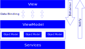

# WPF - MVVM

## Separation of concerns

* **Views**
    * UI Elements Access
* **View Models**
    * View Interaction Logics
* **Models**
    * Model Entities
* **Services** (optional)
    * Shared Client Logic

## Responsabilities




### Model:

* Contains client data.
* Expose relationships between model objects.
* Computed properties.
* Raise change notifications.
    * `INotifyPropertyChanged.PropertyChanged`

### View

* Structural definitions of what user sees on the screen.
* Minimal code behind.
* Preferred **No code behind**.

### View Model

* Expose data to the view.
* Encapsulate interaction logic.
    * Calls to services.
    * Navigation logic.
    * State transformation logic.

### Services

* Shared functionalities.
* Consumed by one or more viewModels.
* Decouples ViewModels from external dependencies.
    * Data storage,
    * Services access.
    * Client environment.
* Can act as data caching container.

## Fundamental equation of MVVM

`View.DataContext = ViewModel`

* View-First
    * View constructed first
    * ViewModel gets constructed and attached to DataContext via View.
    * Example:
        ```Xml
        <UserControl x:Class="example.CustomUserControlView" ...>
            <UserControl.DataContext>
                <local:CustomUserControlViewModel />
            </UserControl.DataContext>
        </UserControl>
        ```

* ViewModel-First
    * ViewModel constructed first
    * View is constructed as a consequence of ViewModel biding add to UI.
    * Example ViewModel:
        ```Xml
        <UserControl.Resources>
            <DataTemplate DataType="{x:Type local:CustomViewModel}">
                <local:CustomView />
            </DataTemplate>
        </UserControl.Resources>
        ...
        <ContentControl Content="{Binding CustomViewModel}" />
        ```
        and on parent ViewModel
        ```c#
            CurrentViewModel = new CustomViewModel();
        ```
    * Example data template (explicit):
        ```Xml
        <UserControl.Resources>
            <DataTemplate x:Key="CustomTemplate">
                <StackPanel>
                    <TextBlock Text="{Binding OrderNumber}">
                    <TextBlock Text="{Binding CustomerName}">
                    <TextBlock Text="{Binding Value}">
                </StackPanel>
            </DataTemplate>
        </UserControl.Resources>
        ...
        <ContentControl Content="{Binding Orders}"
                        ItemTemplate="{StaticResources CustomTemplate}" />
        ```
    * Example data template (implicit):
        ```Xml
        <UserControl.Resources>
            <DataTemplate DataType="{x:Type data:Order}">
                <StackPanel>
                    <TextBlock Text="{Binding OrderNumber}">
                    <TextBlock Text="{Binding CustomerName}">
                    <TextBlock Text="{Binding Value}">
                </StackPanel>
            </DataTemplate>
        </UserControl.Resources>
        ...
        <ContentControl Content="{Binding Orders}" />
        ```


* No One's First
    * Other control construct both View and ViewModel.
    * After the creation set the DataContext.

## Interaction

### Comands

* Command design pattern.
    * Invoker - View control.
    * Receiver - ViewModel.
* Use interface `ICommand`.
* Supports decoupled command handling.
* Supports Enable disable associate control.

* **Example**:
    ```Xml
    <Button Content="Ok" Command="{Binding OkCommand}" ... />
    ```
    And On ViewModel
    ```C#
    public CustomCommand OkCommand { get; private set; }
    
    public CustomUserControl()
    {
        OkCommand = new CustomCommand(OnExecuteOk, OnCanExecuteOk);
    }

    public void OnExecuteOk()
    {
        // Execution of the command
        ...
    }

    public void OnCanExecuteOk()
    {
        return true;
        //Any logic to disable the command
        // To update the control enable/doable state on the view call:
        // OkCommand.RaiseCanExecuteChanged();
    }
    ```

    And On Implementation of ICommand
    ```C#
     public class CustomCommand : ICommand
    {
        private Action targetExecuteMethod;
        private Func<bool> targetCanExecuteMethod;

        public event EventHandler CanExecuteChanged;

        public CustomCommand(Action executeMethod)
        {
            targetExecuteMethod = executeMethod;
        }

        public CustomCommand(Action executeMethod, Func<bool> canExecuteMethod)
        {
            targetExecuteMethod = executeMethod;
            targetCanExecuteMethod = canExecuteMethod;
        }

        public void RaiseCanExecuteChanged()
        {
            CanExecuteChanged(this, EventArgs.Empty);
        }

        public bool CanExecute(object parameter)
        {
            if (targetCanExecuteMethod != null)
            {
                return targetCanExecuteMethod();
            }
            if (targetExecuteMethod != null)
            {
                return true;
            }
            return false;
        }

        public void Execute(object parameter)
        {
            targetExecuteMethod?.Invoke();
        }
    }
    ```

* **Example key binding**:
    ```xml
    <UserControl.InputBindings>
        <KeyBinding Key="S" Modifiers="Control" Command="{Binding OkCommand}" />
    </UserControl.InputBindings>
    ```

## Behaviors (Using Blend SDK)

* In Blend
    1. Go to the View.
    2. Click Assets.
    3. Click on Behaviors.
    4. Select the view on 'Objects and Timeline'.
    5. Double click on 'CallMethodAction' behavior.
    6. Go back to Visual Studio.
* In visual Studio
    1. Following code are generated on Xaml:
        ```xml
        <i:Interactions.Triggers>
            <i:EventTrigger EventName="MouseLeftButtonDown">
                <ei:CallMethodAction />
            </i:EventTrigger>
        </i:Interactions.Triggers>
        ```
    2. Change the name for the desired event:
        ```xml
        <i:Interactions.Triggers>
            <i:EventTrigger EventName="Loaded">
                <ei:CallMethodAction />
            </i:EventTrigger>
        </i:Interactions.Triggers>
        ```
    3. Add the ViewModel binding and the method name
        ```xml
        <i:Interactions.Triggers>
            <i:EventTrigger EventName="Loaded">
                <ei:CallMethodAction TargetObject="{Binding}" MethodName="OnLoaded"/>
            </i:EventTrigger>
        </i:Interactions.Triggers>
        ```
    3. On ViewModel create the method
        ```C#
        public async void OnLoaded()
        {
            ...
        }
        ```

## Properties change notifications

Options

* Use DependencyProperties
    * Not recommended, it's verbose and requires that the object inherits from DependencyObject.
* Implement INotifyPropertyChanged
    * And Invoke the notify event on the Set of the properties.

Example:
* On View Model
    ```C#
        public class CustomViewModel : INotifyPropertyChanged
        {
            private ObservableCollection<Orders> orders;
            public event PropertyChangedEventHandler PropertyChanged = delegate { };
            
            ...

            public ObservableCollection<Orders> Orders
            {
                get
                {
                    return orders;
                }
                set
                {                    
                    if (orders != value)
                    {
                        orders = value;
                        PropertyChanged(this, new PropertyChangedEventArgs("Orders"))
                    }
                }
            }            
        }
    ```

* On Models
    ```C#
        public class Order : INotifyPropertyChanged
        {
            private string customer;

            ...

            public event PropertyChangedEventHandler PropertyChanged = delegate { };                        
            ...

            public string Customer
            {
                get
                {
                    return customer;
                }
                set
                {                    
                    if (customer != value)
                    {
                        customer = value;
                        PropertyChanged(this, new PropertyChangedEventArgs("Customer"))
                    }
                }
            }

            ...
                  
        }
    ```

Extra:

[snippets for notified properties](../../Utils/)


## References
[Introduction to WPF in Visual Studio](https://docs.microsoft.com/en-us/dotnet/framework/wpf/getting-started/introduction-to-wpf-in-vs)
[Patterns - WPF Apps With The Model-View-ViewModel Design Pattern](https://docs.microsoft.com/en-us/archive/msdn-magazine/2009/february/patterns-wpf-apps-with-the-model-view-viewmodel-design-pattern)

