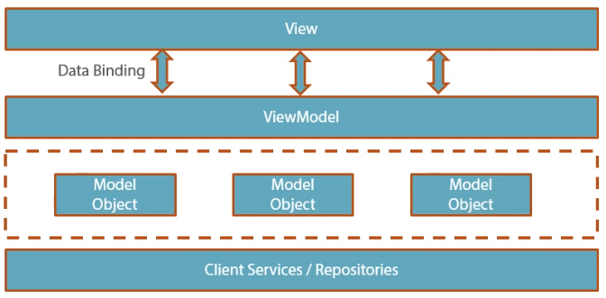

# WPF - MVVM

##Separation of concerns

* **Views**
    * UI Elements Access
* **View Models**
    * View Interaction Logics
* **Models**
    * Model Entities
* **Services** (optional)
    * Shared Client Logic

##Responsabilities




###model:

* Contains client data.
* Expose relationships between model objects.
* Computed properties.
* Raise change notifications.
    * `INotifyPropertyChanged.PropertyChanged`

###View

* Structural definitions of what user sees on the screen.
* Minimal code behind.
* Preferred **No code behind**.

###View Model

* Expose data to the view.
* Encapsulate interaction logic.
    * Calls to services.
    * Navigation logic.
    * State transformation logic.

### Services

* Shared functionalities.
* Consumed by one or more viewModels.
* Decouples ViewModels from external dependencies.
    * Data storage,
    * Services access.
    * Client environment.
* Can act as data caching container.

##Fundamental equation of MVVM

`View.DataContext = ViewModel`

* View-Fist
    * View constructed first
    * ViewModel gets constructed and attached to DataContext via View.
    * Example:
        ```Xml
        <UserControl x:Class="example.CustomUserControlView" ...>
            <UserControl.DataContext>
                <local:CustomUserControlViewModel />
            </UserControl.DataContext>
        </UserControl>
        ```

* ViewModel-First
    * ViewModel constructed first
    * View is constructed as a consequence of ViewModel biding add to UI.
    * Example ViewModel:
        ```Xml
        <UserControl.Resources>
            <DataTemplate DataType="{x:Type local:CustomViewModel}">
                <local:CustomView />
            </DataTemplate>
        </UserControl.Resources>
        ...
        <ContentControl Content="{Binding CurrentViewModel}" />
        ```
        and on parent ViewModel
        ```c#
            CurrentViewModel = new CustomViewModel();
        ```
    * Example data template (explicit):
        ```Xml
        <UserControl.Resources>
            <DataTemplate x:Key="CustomTemplate">
                <StackPanel>
                    <TextBlock Text="{Binding OrderNumber}">
                    <TextBlock Text="{Binding CustomerName}">
                    <TextBlock Text="{Binding Value}">
                </StackPanel>
            </DataTemplate>
        </UserControl.Resources>
        ...
        <ContentControl Content="{Binding Orders}"
                        ItemTemplate="{StaticResources CustomTemplate}" />
        ```
    * Example data template (implicit):
        ```Xml
        <UserControl.Resources>
            <DataTemplate DataType="{x:Type data:Order}">
                <StackPanel>
                    <TextBlock Text="{Binding OrderNumber}">
                    <TextBlock Text="{Binding CustomerName}">
                    <TextBlock Text="{Binding Value}">
                </StackPanel>
            </DataTemplate>
        </UserControl.Resources>
        ...
        <ContentControl Content="{Binding Orders}" />
        ```


* No One's First
    * Other control construct both View and ViewModel.
    * After the creation set the DataContext binding both.

##Interaction

###Comands

* Command design pattern.
    * Invoker - View control.
    * Receiver - ViewModel.
* Use interface `ICommand`.
* Supports decoupled command handling.
* Supports Enable disable associate control.

* **Example**:
    ```Xml
    <Button Content="Ok" Command="{Binding OkCommand}" ... />
    ```
    And On ViewModel
    ```C#
    public CustomCommand OkCommand { get; private set; }
    
    public CustomUserControl()
    {
        OkCommand = new CustomCommand(OnExecuteOk, OnCanExecuteOk);
    }

    public void OnExecuteOk()
    {
        // Execution of the command
        ...
    }

    public void OnCanExecuteOk()
    {
        return true;
        //Any logic to disable the command
        // To update the control enable/doable state on the view call:
        // OkCommand.RaiseCanExecuteChanged();
    }
    ```

    And On Implementation of ICommand
    ```C#
    public class CustomCommand : ICommand
    {
        Action targetExecuteMethod;
        Func<bool> targetCanExecuteMethod;

        public CustomCommand(Action executeMethod)
        {
            targetExecuteMethod = executeMethod;
        }

        public CustomCommand(Action executeMethod, Func<bool> canExecuteMethod)
        {
            targetExecuteMethod = executeMethod;
            targetCanExecuteMethod = canExecuteMethod;
        }

        public void RaiseCanExecuteChanged()
        {
            CanExecuteChanged(this, EventArgs.Empty);
        }

        bool ICommand.CanExecute()
        {
            if (targetCanExecuteMethod != null)
            {
                return targetCanExecuteMethod();
            }
            if (targetExecuteMethod != null)
            {
                return true;
            }
            return false;            
        }

        void ICommand.Execute()
        {
            if (targetExecuteMethod != null)
            {
                targetExecuteMethod();
            }          
        }
    }    
    ```

* **Example key binding**:
    ```xml
    <UserControl.InputBindings>
        <KeyBinding Key="S" Modifiers="Control" Command="{Binding OkCommand}" />
    </UserControl.InputBindings>
    ```

